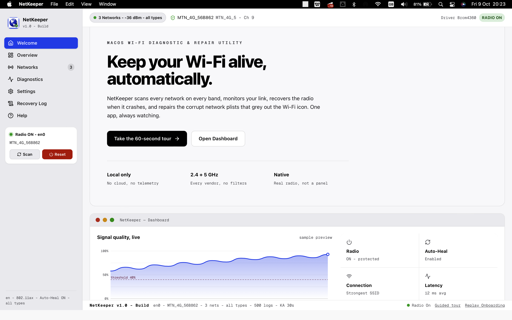
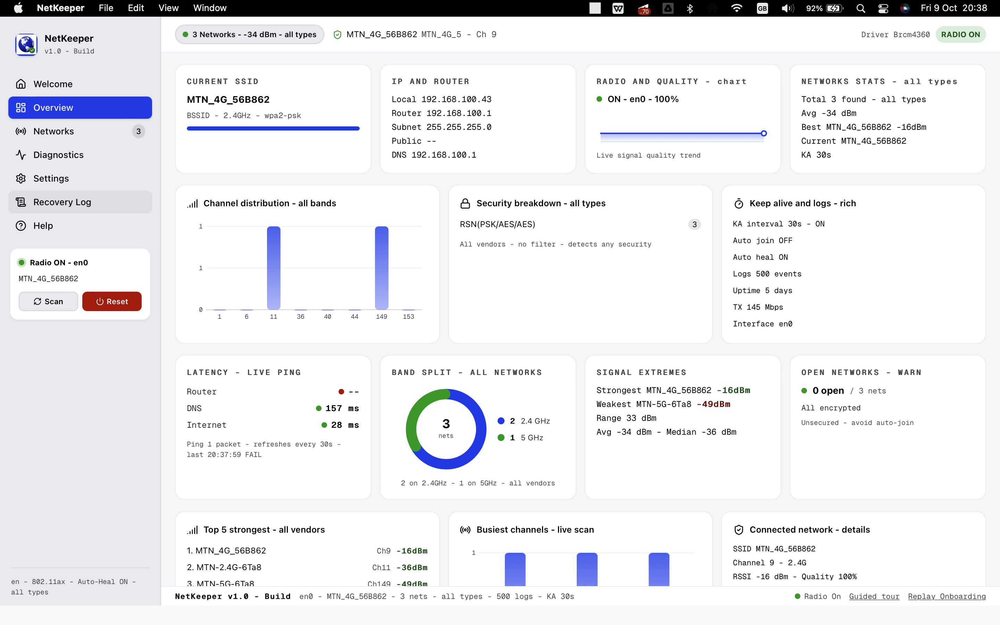
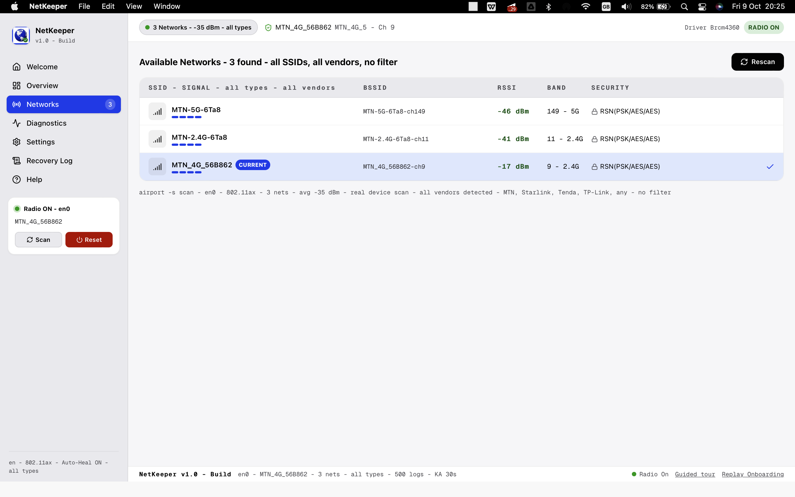
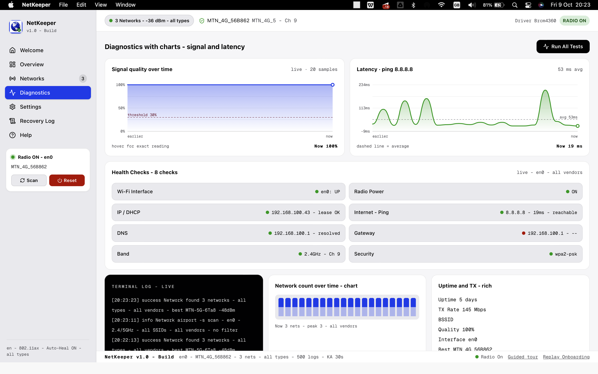
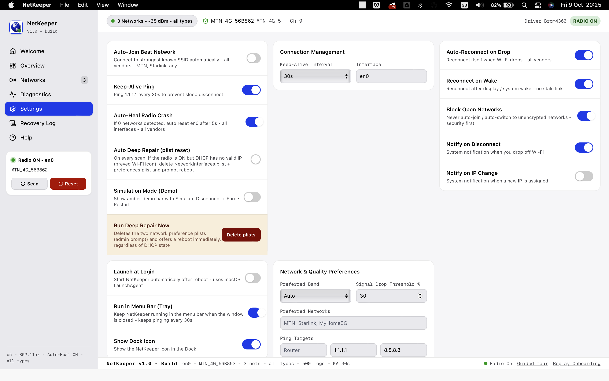

# WiKeep

**A macOS Wi-Fi diagnostic & self-repair utility — keep your connection alive, automatically.**

WiKeep scans every Wi-Fi network on every band, watches your link in real time, auto-recovers the radio when it crashes, switches you to the strongest known access point, and repairs the corrupted macOS network plists that cause the dreaded *greyed-out Wi-Fi icon with a slash*.

> Status: **v3.0.0** · Platform: **macOS (Apple Silicon & Intel)** · Local-first — **no cloud, no telemetry**.

---

## Table of contents

- [Why WiKeep](#why-wikeep)
- [Screens](#screens)
- [Features](#features)
- [How it works](#how-it-works)
- [Deep Network Repair](#deep-network-repair-the-signature-feature)
- [Tech stack](#tech-stack)
- [Getting started](#getting-started)
- [Using the app](#using-the-app)
- [Data, privacy & permissions](#data-privacy--permissions)
- [Project structure](#project-structure)
- [Testing & verification](#testing--verification)
- [Known limitations](#known-limitations)
- [Contributing](#contributing)
- [Roadmap](#roadmap)
- [License](#license)

---

## Why WiKeep

macOS loses Wi-Fi in ways the menu bar never explains. The radio crashes after sleep. The interface mapping corrupts and the icon greys out even though the radio says it is ON. You drift onto a weak access point and never switch back. WiKeep treats these as first-class problems and fixes them — instead of being yet another read-only status panel.

| Problem macOS leaves to you | What WiKeep does |
| --- | --- |
| Wi-Fi icon greyed out / slashed, radio is ON | **Deep Network Repair** resets the network plists and reboots |
| 0 networks found after wake | **Auto-Heal** power-cycles the radio automatically |
| Dropped off the network | **Auto-Reconnect** rejoins the strongest known SSID |
| Stuck on a weak AP | **Auto-Switch** moves you to a better one when it's worth it |
| Stale link after sleep | **Reconnect on Wake** restores the connection |
| No idea what happened | **Recovery Log** records every scan, repair and error |

---

## Screens

Five core screens (real captures live in [`docs/screenshots/`](docs/screenshots/); see the [capture guide](docs/screenshots/README.md)):

| | |
| :---: | :---: |
|  |  |
| **1. Welcome** — feature tour entry point | **2. Dashboard** — live status at a glance |
|  |  |
| **3. Networks** — every SSID, band & signal | **4. Diagnostics** — live signal & latency charts |
|  | |
| **5. Settings** — auto-repair, switching & deep repair | |

---

## Features

### Deep Network Repair *(signature)*
When the Wi-Fi icon is greyed out with a slash *despite the radio being ON*, the macOS interface-to-service mapping has corrupted. WiKeep deletes `NetworkInterfaces.plist` and `preferences.plist` behind a native admin prompt, flushes the DNS cache, and offers to reboot so macOS rebuilds the mapping. Runs on demand or automatically on every scan when enabled.

### Auto-Heal Radio Crash
If a scan returns **0 networks**, WiKeep waits 5 seconds, re-checks, and — if still empty — power-cycles the radio (`networksetup -setairportpower off/on`) with a BSSID cache purge. Includes a 60-second cooldown so it never thrashes.

### Real, Unfiltered Scanning
Reads the hardware through `airport -s` across **2.4 GHz and 5 GHz** on every vendor — MTN, Starlink, Tenda, TP-Link, hotspots, anything. No allow-list, no vendor filter. Parses SSID, BSSID, RSSI, channel and security with a robust RSSI-token detector.

### Auto-Reconnect & Best-Network Switching
- Reconnects automatically when the link drops.
- Switches to a stronger **known** network when the signal gain justifies it (≥ 12 dB, or when quality falls below your threshold).
- Honours a preferred band (Auto / 2.4 GHz / 5 GHz), respects preferred networks, and can block open/unencrypted networks.

### Reconnect on Wake
Detects wake-from-sleep via a heartbeat gap and restores the connection so you never return to a dead link.

### Keep-Alive Pings
Configurable interval pings to your router, DNS and the internet keep the link warm and surface latency problems early.

### Live Diagnostics & Charts
Dependency-free SVG charts: a smooth gradient **area chart** for signal quality (with a red threshold line), a latency **area chart** with an average line, a **bar chart** for channel congestion, and a **donut** for 2.4/5 GHz band split — all hoverable with exact readings.

### Persistent Recovery Log
Every scan, repair, switch and error is written to a durable JSONL log you can read back and clear.

### Menu Bar, Notifications & Autostart
Runs quietly in the menu bar, sends native notifications on disconnect and IP change, and can launch at login via a macOS LaunchAgent.

### Landing Page & Guided Tour
A built-in, webpage-style **Welcome** tab explains every feature in detail, and a 10-step **spotlight tour** walks you through the real UI with Next / Back / Skip.

---

## How it works

1. **Scan** — WiKeep reads the real radio and lists every network on every band.
2. **Watch** — the connection manager monitors the link, keeps it alive, and auto-recovers the radio if it crashes or the plists go bad.
3. **Repair** — when the OS-level Wi-Fi state breaks, Deep Network Repair resets the plists and reboots you back to a working radio.

---

## Deep Network Repair (the signature feature)

The two files below hold macOS's interface → network-service mapping. When they corrupt, the Wi-Fi icon greys out with a slash while the radio still reports **ON**:

```
/Library/Preferences/SystemConfiguration/NetworkInterfaces.plist
/Library/Preferences/SystemConfiguration/preferences.plist
```

WiKeep removes them **as root** via a native `osascript … with administrator privileges` prompt (it never stores or sees your password), flushes the cache, and prompts a reboot. On restart, macOS rebuilds a clean mapping.

**When to use it:** the slashed/greyed Wi-Fi icon, Wi-Fi shows "On" but no networks, or DHCP stays broken after other resets. Enable *Auto Deep Repair* to trigger it automatically when a scan detects *radio ON but no valid IPv4 lease*.

---

## Tech stack

| Layer | Technology |
| --- | --- |
| Shell | [Tauri 1.5/1.8](https://tauri.app/) (Rust) |
| Backend | Rust 2021 · `std::process` · `objc` (macOS activation policy) |
| Frontend | React 18 · TypeScript 5 · Vite 5 |
| Styling | TailwindCSS 3 |
| Icons | lucide-react |
| Charts | Custom SVG (zero dependencies) |

---

## Getting started

### Prerequisites
- macOS 12+ (Monterey or newer recommended)
- [Node.js](https://nodejs.org/) 18+
- [Rust](https://www.rust-lang.org/tools/install) (stable) + Xcode Command Line Tools
- [Tauri prerequisites](https://tauri.app/v1/guides/getting-started/prerequisites) for macOS

### Install & run (development)

```bash
git clone git@github.com:FehintoluSamuel/WiKeep.git
cd WiKeep

npm install
npm run tauri dev
```

### Build a release bundle

```bash
npm run tauri build
```

The `.app` and `.dmg` land in `src-tauri/target/release/bundle/`.

### Handy scripts

| Command | What it does |
| --- | --- |
| `npm run dev` | Vite dev server only (frontend, port 1420) |
| `npm run build` | Type-check + production frontend build |
| `npm run tauri dev` | Full app with hot reload |
| `npm run tauri build` | Signed app + installer bundles |

---

## Using the app

The sidebar has seven tabs:

| Tab | Purpose |
| --- | --- |
| **Welcome** | Webpage-style landing page + entry point to the guided tour |
| **Overview** | Live dashboard: SSID, IP/router, radio status, signal trend, stats |
| **Networks** | Full scan results with BSSID, RSSI, band and security |
| **Diagnostics** | Signal & latency charts plus gateway/DNS/internet health checks |
| **Settings** | Repair, switching, keep-alive, notifications, startup, deep repair |
| **Recovery Log** | Persistent, chronological event log |
| **Help** | Reference documentation for every feature |

Launch the **guided tour** from the Welcome hero, the final CTA, or the footer link. It spotlights the real controls and explains what each does.

---

## Data, privacy & permissions

**Everything stays on your Mac.** No analytics, no network calls except the optional ping/latency probes and public-IP lookup.

| Item | Location |
| --- | --- |
| Settings | `~/.config/wikeep/settings.json` |
| Logs | `~/.config/wikeep/logs.jsonl` |
| Autostart | `~/Library/LaunchAgents/com.wikeep.app.plist` |

**Permissions:** macOS requires **Location Services** access for `airport -s` to list all nearby networks. Without it you may only see the network you are connected to. Admin rights are requested only for Deep Network Repair, through the native system dialog.

---

## Project structure

```
wikeep-final/
├── index.html                  # Vite entry (mounts /src/main.tsx)
├── src/
│   ├── App.tsx                 # Entire UI: tabs, logic, charts, landing, tour
│   ├── Onboarding.tsx          # First-run permission modal
│   ├── main.tsx                # React root
│   ├── Help.tsx                # (legacy) — active help lives in App.tsx
│   └── index.css
├── src-tauri/
│   ├── src/main.rs             # All Rust commands, tray, window events
│   ├── Cargo.toml
│   ├── tauri.conf.json         # Window, bundle, allowlist, tray config
│   └── icons/
├── docs/
│   ├── architecture.md
│   ├── functional-and-non-functional-requirements.md
│   └── screenshots/
└── README.md
```

See [`docs/architecture.md`](docs/architecture.md) for the full breakdown.

---

## Testing & verification

This project currently verifies via static checks (no automated test suite yet):

```bash
npx tsc --noEmit                      # TypeScript type-check
cd src-tauri && cargo check           # Rust compile check
npm run build                         # Full frontend build
```

> Runtime behavior (radio scans, Deep Repair, switching) must be validated on real macOS hardware — it cannot be exercised in CI.

---

## Known limitations

- **`airport` is deprecated** by Apple and may be removed in a future macOS. Migration to `CoreWLAN` / `wdutil` is on the roadmap.
- Wi-Fi **passwords are never stored**; auto-connect only works for networks macOS already knows.
- The **guided tour** highlights controls via `data-tour` attributes — new features should add these to appear in the tour.
- Deep Network Repair **requires a reboot** to fully complete.
- `src/Help.tsx` and `src/main.js`/`src/style.css` are **legacy** and unused; the active help UI and styles live in `App.tsx`.

---

## Contributing

Contributions, issues and ideas are very welcome — this is a solo-built project that would love collaborators.

- Read [`CONTRIBUTING.md`](CONTRIBUTING.md) for setup, coding conventions and the PR checklist.
- Good first areas: `CoreWLAN` migration, automated tests, more chart types, localization.
- Please open an issue before large changes so we can align on direction.

---

## Roadmap

- [ ] Migrate scanning/stats from deprecated `airport` to `CoreWLAN`
- [ ] Automated unit tests for the Rust command layer
- [ ] Wi-Fi event history & per-network reliability scoring
- [ ] Optional scheduled speed tests
- [ ] Localization (i18n)

---

## License

Released under the [MIT License](LICENSE). See the [`LICENSE`](LICENSE) file for the full text.
